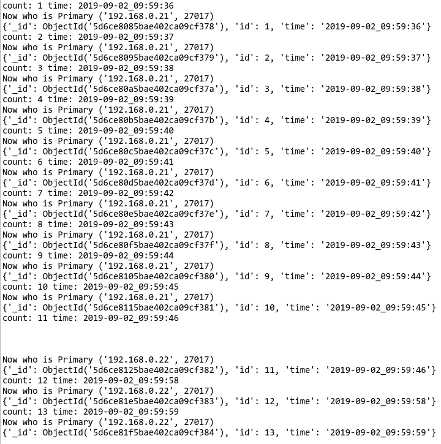

> Example environment  
> System : CentOS 7 x64  @ Vultr.com  
> MongoPrimary IP: 192.168.0.21  
> MongoSeconday IP: 192.168.0.22  
> MongoArbiter IP: 192.168.0.22

# Install using repository 
[REF mongodb.com](https://docs.mongodb.com/manual/tutorial/install-mongodb-on-red-hat/#install-mongodb-community-edition-on-red-hat-enterprise-or-centos-linux)

```bash
$ cat << EOF > /etc/yum.repos.d/mongodb-org-4.2.repo
[mongodb-org-4.2]
name=MongoDB Repository
baseurl=https://repo.mongodb.org/yum/redhat/7/mongodb-org/4.2/x86_64/
gpgcheck=1
enabled=1
gpgkey=https://www.mongodb.org/static/pgp/server-4.2.asc
EOF
$ yum install -y mongodb-org
```

# Configure Local Nic IP Address

ATTENTION : Modify IPADDR as needs

```bash
$ cat << EOF > /etc/sysconfig/network-scripts/ifcfg-eth1
NAME="eth1"
DEVICE="eth1"
TYPE="Ethernet"
ONBOOT="yes"
BOOTPROTO="static"
IPADDR="192.168.0.20"
PREFIX="24"
EOF
systemctl restart network
``` 

# Configuration  
net.bindIp = localhost, "eth0IP"  
replication.replSetName = "rs0"  
replication.enableMajorityReadConcern = false

# Setup replication set

## [Disable Read Concern Majority](https://docs.mongodb.com/manual/reference/read-concern-majority/#disable-read-concern-majority)


## Initiate
[REF mongodb.com](https://docs.mongodb.com/manual/tutorial/deploy-replica-set/#initiate-the-replica-set)

```mongo
> rs.initiate({
   _id : "rs0",
   members: [
      { _id: 0, host: "192.168.0.21:27017" },
      { _id: 1, host: "192.168.0.22:27017" }
   ]
})
> rs.addArb("192.168.0.23:27017")
```


# Test Python Scripts

```python
#!/usr/bin/env python3
import time
from pymongo import MongoClient
db = MongoClient('192.168.0.22:27017', replicaSet='rs0').test
count = 1
while True:
    _t = time.strftime("%Y-%m-%d_%H:%M:%S", time.localtime())
    print("count: {} time: {}".format(count, _t))
    db.test.insert_one({"id": count,"time": _t})
    print("Now who is Primary {}".format(db.client.address))
    print(db.test.find_one({"id":count}))
    count= count + 1
    time.sleep(1)
```

