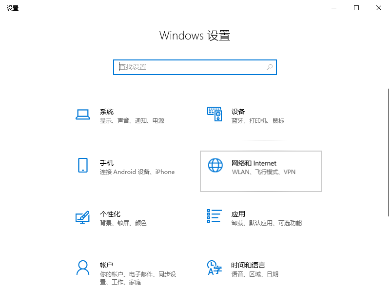
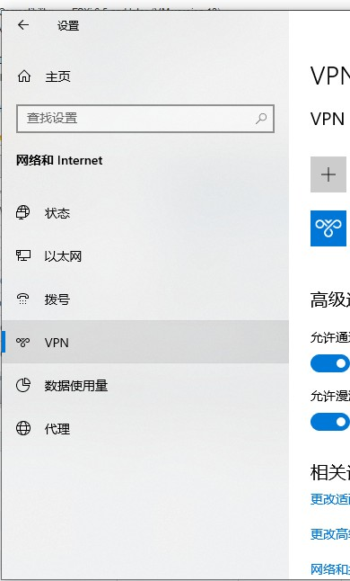
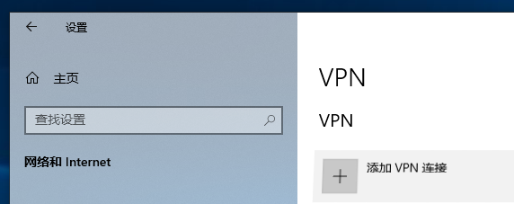
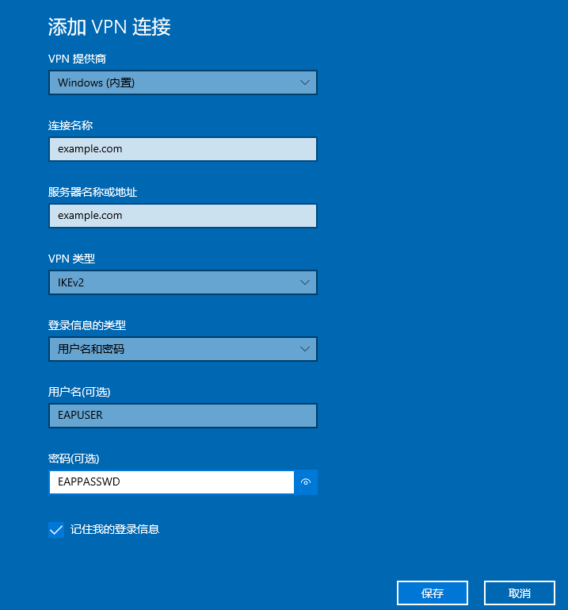
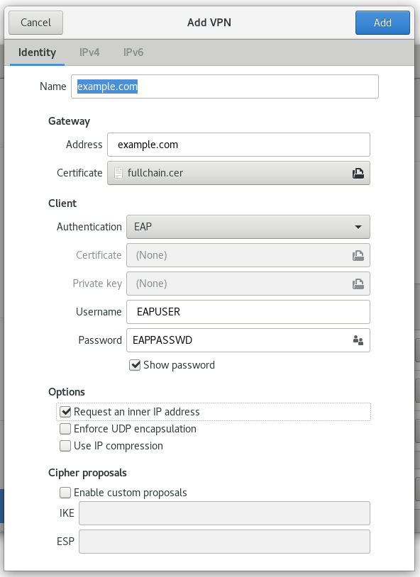

> Example environment  
System: CentOS 7 x64 Minimal (After Profiling by [CentOS 7 Minimal Post Install](../运维/Linux/CentOS-7-Post-Install.md))   
SSL Domain: example.com (After issue certificate following [Letsencrypt](../运维/Letsencrypts.md))

# Server end
## Install strongswan 
```bash
$ wget http://download-ib01.fedoraproject.org/pub/epel/7/x86_64/Packages/s/strongswan-5.7.2-1.el7.x86_64.rpm && \
yum install -y strongswan-5.7.2-1.el7.x86_64.rpm
```

## [Issue SSL certs](../运维/Letsencrypts.md)

## Configurate strongswan
Assuming SSL certs deploy into /etc/nginx/certs, which contains:  
* ca.cer  
* fullchain.cer  
* example.com.cer  
* example.com.conf  
* example.com.csr  
* example.com.cer.conf  
* example.com.key  
---
Assume EAP user named EAPUSER, password set to EAPPASSWD.

**Install certs to strongswan**
```bash
$ ln -snf /etc/nginx/certs/example.com/ca.cer /etc/strongswan/ipsec.d/cacerts/ca.cer
$ ln -snf /etc/nginx/certs/example.com/fullchain.cer /etc/strongswan/ipsec.d/certs/fullchain.cer
$ ln -snf /etc/nginx/certs/example.com/example.cer /etc/strongswan/ipsec.d/certs/example.cer
$ ln -snf /etc/nginx/certs/example.com/example.key /etc/strongswan/ipsec.d/private/example.key
```

**/etc/strongswan/ipsec.conf**
```text
config setup
    uniqueids=never

conn %default
    keyexchange=ikev2
    ike=aes256-sha1-modp1024,aes128-sha1-modp1024,3des-sha1-modp1024
    esp=aes256-sha256,aes256-sha1,3des-sha1

    leftauth=pubkey
    leftsendcert=always

    rightsourceip=10.24.1.0/24
    rightdns=8.8.8.8

    rekey=no
    reauth=no
    auto=add

conn Client-EAP
    fragmentation=yes
    
    leftcert=fullchain.cer
    leftsubnet=0.0.0.0/0

    rightauth=eap-mschapv2
    eap_identity=EAPUSER
```

**/etc/strongswan/ipsec.secrets**
```text
fullchain.cer : RSA example.com.key
EAPUSER %any : EAP "EAPPASSWD"
```

**Enable NAT**
```bash
$ echo 'net.ipv4.ip_forward=1' > /etc/sysctl.d/ipforward.conf && \
    sysctl -p /etc/sysctl.d/ipforward.conf && \ 
    iptables -t nat -L -s 10.24.1.0/24 -o eth0 -j MASQUERADE && \
    service iptables save
```

# Client end

## Windows 10

* 开始 -> 设置 -> 网络和Internet -> VPN  
  

  

* 添加VPN连接  
  

  

* 保存

## Linux(Using NetworkManager strongswan plugin)  
* Install "NetworkManager strongswan plugin"  
`$ sudo yum install -y NetworkManager-strongswan-gnome NetworkManager-strongswan`  
reload gnome-shell with 'Alt+F2 restart'

* Copy fullchain.cer to somewhere( Example in ~/Documents/certs/exmaple.com/)

* Open gnome-settting -> Select Network -> Click '+' in the VPN part  
  

* Choose IPsec/IKEv2(strongswan) -> Configure it like this:  
  

* Click Add button to save the connection