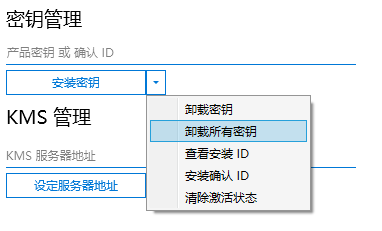

# Download  
https://server.lancdn.com/landian/OfficeToolPlus/OTPUpdater.exe

# Usage  
https://blog.csdn.net/u011054333/article/details/83448671

# Example  
1. Once OfficeTool installed, start it and location to Active tab:  
  

2. 清除所有许可证  
  

3. 清除所有密钥  
  
  
4. Choose "Office 2019 **Volume**" Then [安装许可证]

5. Input "NMMKJ-6RK4F-KMJVX-8D9MJ-6MWKP" Then [安装密钥]  

6. Input "kms.03k.org" Then [设定服务器地址]

7. [激活]