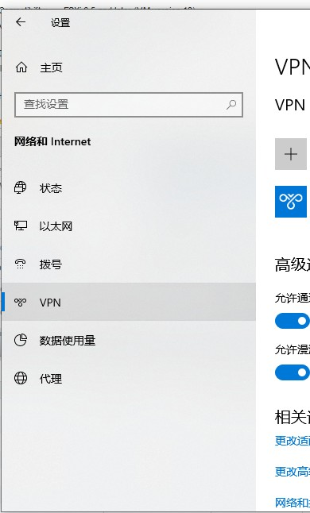
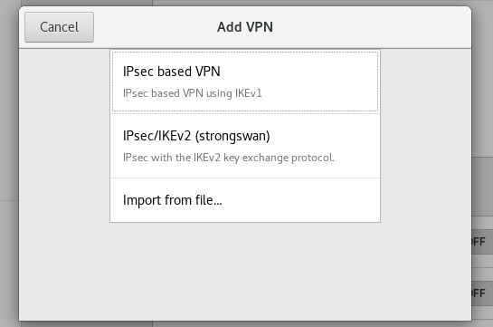

> Example environment  
> Windows : Version 10  
> Linux : Release of CentOS7 with gnome  
> IKEv2 VPN Server : Build follow [This Guide]([Server]%20-%20IKEv2%20VPN via%20strongswan.html)

# Windows 10

### 开始 -> 设置 -> 网络和Internet -> VPN  
  

  

### 添加VPN连接  
  

  

### 保存

# Linux(Using NetworkManager strongswan plugin)  
### Install "NetworkManager strongswan plugin"  
`$ sudo yum install -y NetworkManager-strongswan-gnome NetworkManager-strongswan`  
reload gnome-shell with 'Alt+F2 restart'

### Get fullchain.cer to somewhere( Example in ~/Documents/certs/exmaple.com/)

### Open gnome-settting -> Select Network -> Click '+' in the VPN part  
  

### Choose IPsec/IKEv2(strongswan) -> Configure it like this:  
  

### Click Add button to save the connection